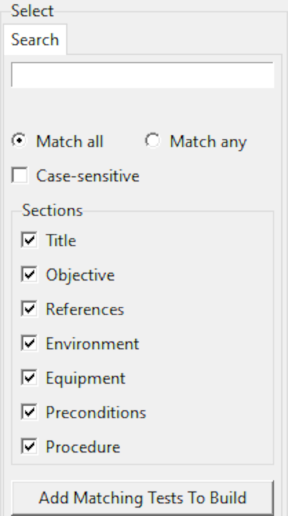
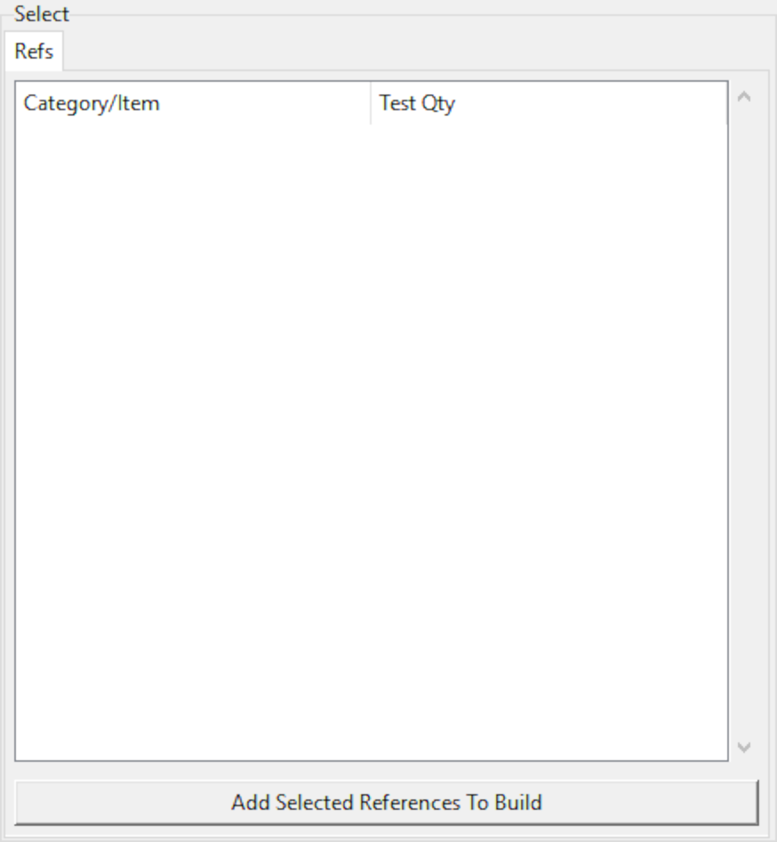

.. _gui:

Graphical User Interface
========================

A graphical user interface, or *GUI*, is available to help navigate available
tests for the purpose of selecting which to generate PDFs for.
The GUI is optional, enabled
via the ``--gui`` :ref:`command line option <cli_gui>`;
no script modification is necessary to use the GUI.

Altering content is not possible with the GUI, i.e., it has no editing
capability. Modifications must be made with an external program,
such as a text editor or IDE. Furthermore, the GUI will not automatically
incorporate changes to the source scripts; it must be restarted.

The GUI is actually launched by :py:func:`atform.generate`,
which does not return until the GUI is closed. If the script contains
code after :py:func:`atform.generate`, such as exporting metadata to
external files, that code will not be executed until the GUI
terminates.

.. _gui_select:

Select
------

The left panel facilitates choosing which tests to build into PDFs.
The :guilabel:`Select` panel contains a set of tabs, each presenting
a different filtering and organization method. Tests selected in these
tabs are accumulated in the :ref:`gui_build` panel.

.. _gui_select_list:

List
^^^^

The :guilabel:`List` tab presents all defined tests sorted according to
their numeric identifier, and organized into a heirarchy if sections have
been enabled with :py:func:`atform.set_id_depth`.

Tests can be selected via mouse click; multiple selections can be made
using the typical :kbd:`Control` and :kbd:`Shift` mouse click combinations.
Selecting a section implicitly includes all contained subsections and tests.
Clicking the :guilabel:`Add Selected Tests To Build` button will add
all selected tests to the :ref:`gui_build` list.
In addition to toggling the selection, clicking on a test in the list will
also display that test in the :ref:`gui_preview` window.

Search
^^^^^^

The :guilabel:`Search` tab provides a way to select tests by searching for
specific content. Query text is entered in the field at the top of the tab,
then clicking the :guilabel:`Add Matching Tests To Build` button
or pressing :kbd:`Enter` while focus is on the query entry field will add
matching tests to the :ref:`gui_build` list.

When the query contains multiple words the :guilabel:`Match all` and
:guilabel:`Match any` options determine which words must be found to
constitute a match. A test must contain every word in the query if
:guilabel:`Match all` is enabled; the :guilabel:`Match any` option will
yield a match if a test contains at least one query word.

Words need not appear in the same order as the query.
For example, the query :samp:`cat dog` matches
:samp:`dog chases cat` even though the terms are ordered differently
and separated by nonmatching text.
Enclosing multiple words in double quotation marks will
search for the complete phrase, e.g., changing the query to
:samp:`"cat dog"` does not match the example text.

The :guilabel:`Case-sensitive` option will require text to conform to the
query text case. E.g., :samp:`python` only matches :samp:`Python` if
:guilabel:`Case-sensitive` is not checked.

The set of options in the :guilabel:`Sections` panel correspond to the
principal divisions of a test document; content from specific sections can be
excluded from searches by unchecking areas to be ignored.

Diff
^^^^

The :guilabel:`Diff` tab allows test selection based on changes relative to
another version of the script; |project_name| compares the two
versions and selections can be made based on the type of changes detected.
While not strictly required, this function is intended for use with
script files maintained by a :ref:`version control system <vcs>`.

Content from two script versions is required to perform a comparison:
one is the current state of the script, and the other is taken
from the cache file. The following procedure describes how to load
a specific script version into the cache file such that it can be used
for comparsion:

#. Check out the version serving as the basis for comparison, typically
   the older version.

#. Run the script normally. The sole purpose of this step is to update the
   cache file with test content; it is unnecessary to use the GUI or
   generate any PDFs at this point because |project_name| writes all
   content to the
   cache file regardless of which PDFs are built. Running the script
   with a nonexistent ID given as a :ref:`command line option <cli_id>`
   will prevent any PDF output, making this step very quick.

#. Check out the version containing content to be built into PDFs,
   typically newer than the version checked out in the first step.

#. Run the script with the ``--gui`` option. The current test content
   will be compared with content stored in the cache, i.e, the version
   checked out in the first step. The GUI :guilabel:`Diff` tab will
   present a summary of changes which can be selectively added to the
   :ref:`gui_build`.

Refs
^^^^

The :guilabel:`Refs` tab organizes tests according to reference,
as described in :ref:`ref`. All categories defined by
:py:func:`atform.add_reference_category` are listed; below each are
items assigned via the :py:func:`atform.add_test` ``references``
parameter. The :guilabel:`Test Qty` column indicates the number of tests
assocated with each category and item.

Selecting an item or category and clicking
:guilabel:`Add Selected References To Build` will add referring tests to
the :ref:`gui_build` list. Multiple items may be selected with the usual
:kbd:`Control` and :kbd:`Shift` combinations. Selecting a category
is equivalent to selecting all items within that category.

.. _gui_preview:

Preview
-------

.. image:: images/gui/preview.png
   :align: center

The center panel displays test content. It has no controls for user input;
selecting tests in the :ref:`gui_select_list` or :ref:`gui_build` windows
will automatically update the :guilabel:`Preview` display.

Presentation in the :guilabel:`Preview` window does *not* reflect
formatting in PDF output. This area is intended only as a rudimentary
display to aid in test selection.

Along with displaying content, the location of the
:py:func:`atform.add_test` function call that created the test appears
at the bottom of the :guilabel:`Preview` window.

.. _gui_build:

Build
-----

.. image:: images/gui/build_list.png
   :align: center

The rightmost panel lists tests queued for PDF generation. It is initially
empty, and is populated using the :ref:`gui_select` panel.
Once the desired tests have been added,
the :guilabel:`Build PDFs` button will start the process of generating
PDFs. All tests listed in this panel will be built,
regardless of which, if any, are selected. To remove items from this list,
select them in the same manner as the :ref:`gui_select_list` panel,
and click the :guilabel:`Remove Selected` button.

The :guilabel:`Path` and :guilabel:`Folder Depth` options are equivalent
to the :py:func:`atform.generate` parameters of the same name,
allowing the PDF output directory to be altered without script modification.

A pop-up dialog will appear while building output documents, displaying
progress and any errors. The build process may be cancelled by
closing the pop-up dialog.

This list will be cleared after building, allowing another set of tests
to be selected and built.

Status Bar
----------

Along the bottom of the main GUI window is a traditional status bar
conveying various ancillary conditions. Unless otherwise noted, all
status bar information is static, i.e., it is captured when the script is
initially run and not dynamically updated if content is altered while
the GUI is running. The GUI must be closed and the script re-executed to
detect external changes.

VCS
^^^

The :guilabel:`VCS` indicator reflects the state reported by the
:ref:`version control system <vcs>`. In addition to a SHA1 or
:literal:`draft`, this indicator will also show :literal:`No VCS`
if version control is absent.

ID Lock
^^^^^^^

The :guilabel:`ID Lock` indicator shows the state of the lock file discussed in
:ref:`idlock`. This indicator will display :literal:`ok` if the existing
tests are consistent with the lock file, or :literal:`stale` if the lock file
needs to be updated as described in :ref:`idlock`.
