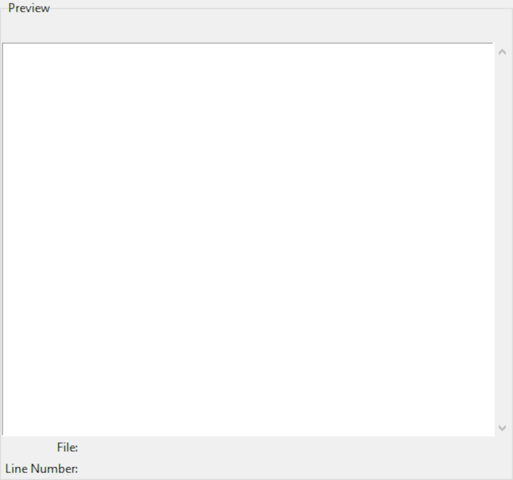
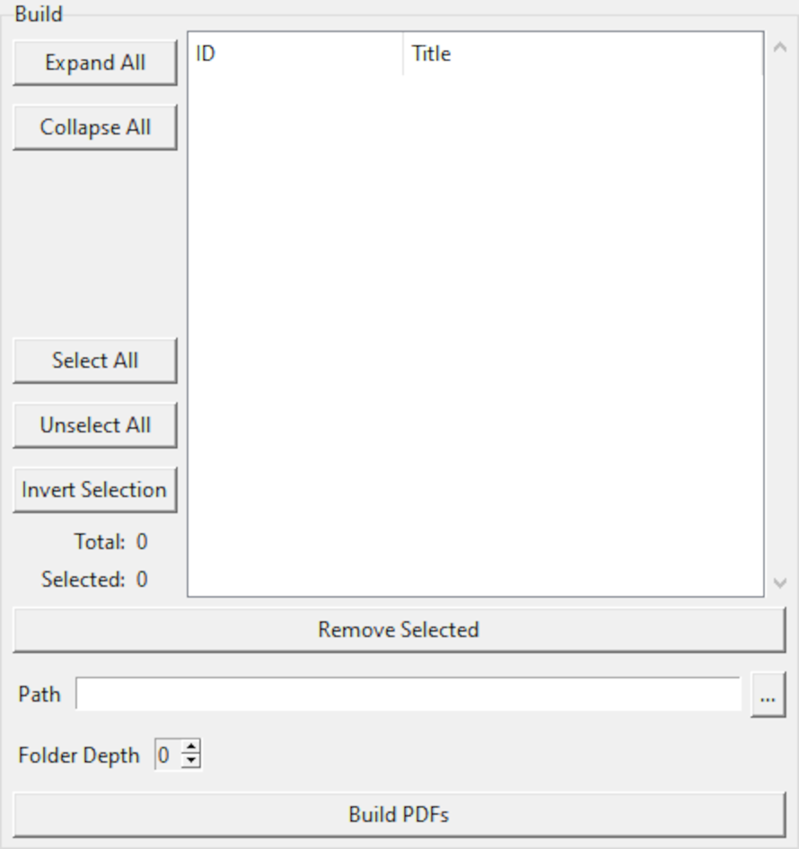

.. _gui:

Graphical User Interface
========================

A graphical user interface, or *GUI*, is available to help navigate available
tests for the purpose of selecting which to generate PDFs for.
The GUI is optional, enabled
via the ``--gui`` :ref:`command line option <cli_gui>`;
no script modification is necessary to use the GUI.

Altering content is not possible with the GUI, i.e., it has no editing
capability. Modifications must be made with an external program,
such as a text editor or IDE. Furthermore, the GUI will not automatically
incorporate changes to the source scripts; it must be restarted.

The GUI is actually launched by :py:func:`atform.generate`,
which does not return until the GUI is closed. If the script contains
code after :py:func:`atform.generate`, such as exporting metadata to
external files, that code will not be executed until the GUI
terminates.

.. _gui_select:

Select
------

The left panel facilitates choosing which tests to build into PDFs.
The :guilabel:`Select` panel contains a set of tabs, each presenting
a different filtering and organization method. Tests selected in these
tabs are accumulated in the :ref:`gui_build` panel.

.. _gui_select_list:

List
^^^^

.. image:: images/gui/select_list.png
   :align: center

The :guilabel:`List` tab presents all defined tests sorted according to
their numeric identifier, and organized into a heirarchy if sections have
been enabled with :py:func:`atform.set_id_depth`.

Tests can be selected via mouse click; multiple selections can be made
using the typical :kbd:`Control` and :kbd:`Shift` mouse click combinations.
Selecting a section implicitly includes all contained subsections and tests.
Clicking the :guilabel:`Add Selected Tests To Build` button will add
all selected tests to the :ref:`gui_build` list.
In addition to toggling the selection, clicking on a test in the list will
also display that test in the :ref:`gui_preview` window.

.. _gui_preview:

Preview
-------

The center panel displays test content. It has no controls for user input;
selecting tests in the :ref:`gui_select_list` or :ref:`gui_build` windows
will automatically update the :guilabel:`Preview` display.

Presentation in the :guilabel:`Preview` window does *not* reflect
formatting in PDF output. This area is intended only as a rudimentary
display to aid in test selection.

Along with displaying content, the location of the
:py:func:`atform.add_test` function call that created the test appears
at the bottom of the :guilabel:`Preview` window.

.. _gui_build:

Build
-----

The rightmost panel lists tests queued for PDF generation. It is initially
empty, and is populated using the :ref:`gui_select` panel.
Once the desired tests have been added,
the :guilabel:`Build PDFs` button will start the process of generating
PDFs. All tests listed in this panel will be built,
regardless of which, if any, are selected. To remove items from this list,
select them in the same manner as the :ref:`gui_select_list` panel,
and click the :guilabel:`Remove Selected` button.

A pop-up dialog will appear while building output documents, displaying
progress and any errors. The build process may be cancelled by
closing the pop-up dialog.

This list will be cleared after building, allowing another set of tests
to be selected and built.
