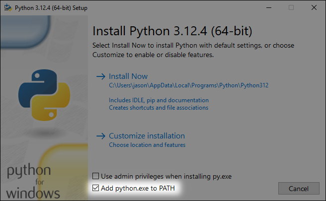
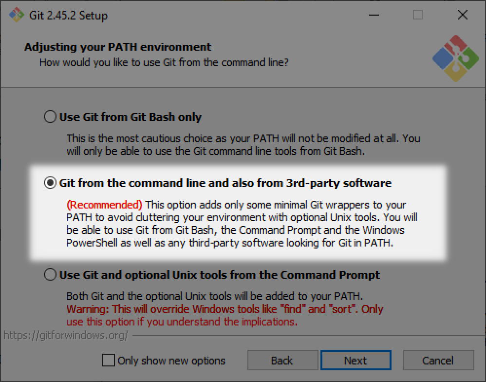

Introduction
============

The |project_name| software is intended for writing test procedures, which often
requires significant repetition, iteration, or other similar
time-consuming and error-prone tasks where computers excel.
This software employs the Python programming language to help alleviate
these burdens, such as formatting and
ensuring consistency across duplicate material, freeing the author to focus
on content.

While the test author will need to write what are in fact small Python
programs to use this system, no previous experience with Python or
other programming language is required.
Only elementary Python knowledge is needed to use the |project_name| package,
much of which can be gleaned from the examples in this guide.
Furthermore, Python's popularity means a wealth of information is
available online, all of which will be directly
applicable as |project_name| is a normal Python package, and does not alter or
limit the language in any way.

.. _install:

Installation
------------

|project_name| is compatible with any operating system on which the
requisite Python version listed below is available, including
Windows, Linux, and macOS.

The Python programming language, version |requires_python| or later,
must be installed,
and is available from `<https://python.org>`_. Make sure to select the
add Python to the path option from the installation dialog:

The |project_name| package can be installed after Python using the following
procedure:

#. The |project_name| package is distributed as an attachment embedded into this
   PDF manual. Save the :file:`.whl` file to a convenient location on
   your computer.

#. Open a command prompt and navigate to the directory where the :file:`.whl`
   file was saved.

#. The Python package manager, pip, is used to install the |project_name| package,
   and requires a functional Internet connection. Use the following
   command executed in the command prompt:

   .. code-block:: text

      pip install testgen-0.0.0-py3-none-any.whl

   If |project_name| is already installed, use the ``-U`` option to upgrade to a
   newer version:

   .. code-block:: text

      pip install -U testgen-0.0.0-py3-none-any.whl

#. Delete the :file:`.whl` file; it is not required after installation.

The git version control system is optional, needed only to use the
features described in :ref:`vcs`. Any 2.x git release is acceptable,
but *must* be the standard git command line interface, or CLI, available
from `<https://git-scm.com>`_.
Furthermore, git must be installed into the system path. The image
below shows the Windows installation dialog selecting the requisite
path option:

Testing to ensure git is properly installed can be done by running
:command:`git --version` in a command prompt, which should yield
something like :samp:`git version {x.y.z}`.

Getting Started
---------------

Writing tests involves creating a set of Python scripts containing
procedure content, e.g., title, procedure steps, etc. These scripts are
then executed with Python to generate the output PDFs.

An important concept to note is these scripts are plain text files and do
not contain formatting, such as font selection or table configuration.
The |project_name| package will handle formatting the output PDFs; the author need
only provide content and structure, i.e., what is in the tests and how
they are organized.

As Python scripts are regular text files, they can be created and edited
with any text editor, however, it is *highly* recommended to use an editor
with integrated Python support. A significant feature when selecting an
editor is the ability to provide contextual help, which will display the
same documentation presented in the :ref:`api` section of this manual
directly in the editor window when each command is used. Having
the necessary documentation immediately and automatically available
while writing tests is quite convenient.
Many suitable editors are freely-available; some popular ones are listed below:

.. csv-table::
   :header: Name, URL, "Context Help"

   Notepad++, `<https://notepad-plus-plus.org/>`_, No
   Sublime Text, `<https://www.sublimetext.com/>`_, Yes
   Visual Studio Code, `<https://code.visualstudio.com/>`_, Yes
   PyCharm, `<https://www.jetbrains.com/pycharm/>`_, Yes

The Python installation also includes a simple, yet functional editor, IDLE,
although it does not feature context help. One note about IDLE is
it starts in an interactive window, showing something like this:

.. code-block:: text

   Python 3.10.0 (tags/v3.10.0:b494f59, Oct  4 2021, 19:00:18)
   Type "help", "copyright", "credits" or "license()" for more information.
   >>>

The interactive window is for running Python commands one at a time as they
are entered, not editing scripts saved to files. Use the
:menuselection:`File --> New` menu
to open a new editor window for creating a script that will be saved to disk.

Below is a minimal example to illustrate the basic layout of a |project_name|
Python script. All examples in this manual are fully-functional, attached
to the PDF in the same way as the |project_name| package, and can be
used as initial templates for writing actual test procedures.

.. literalinclude:: examples/minimal.py

This example contains three, rather spartan tests, containing only a
title and automatically-assigned number, yet is sufficient to demonstrate
the entire workflow from source script to output PDF. Simple tests without
much content are also common when creating an initial outline.
Obviously, test procedures will require much more detail,
which can be provided by additional parameters to the
``testgen.Test()`` class; refer to the :py:class:`testgen.Test` reference
documentation for further details.

Executing this script with Python will yield the output files, one PDF per
test procedure. Most Python editors or integrated development
environments(IDEs) have features to run scripts from within the editor.
If integrated execution is not an option, running Python from the command line
is always available regardless of how the scripts are created and edited.
Open a command prompt, navigate to the folder where
the script is stored, then execute the following command:

.. code-block:: text

   python minimal.py

If the requisite software was installed successfully, the output PDFs will
be created in the :file:`pdf` folder within the same location as the
source script.
